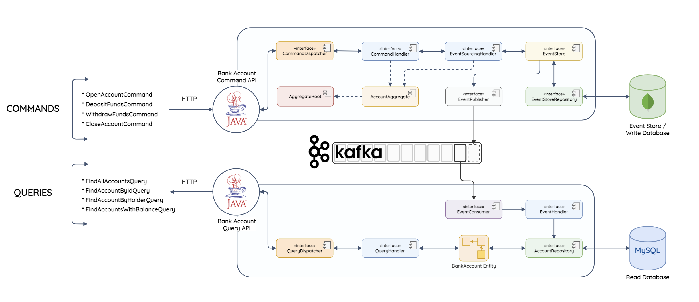

# CQRS and Event Sourcing with Kafka

This is my PoC Project of CQRS and Event Sourcing with Kafka.
CQRS stands for Command Query Responsibility Segregation. It's a pattern that separates the read and write operations of a data store.
It gives you a performance boost and allows you to scale your system more easily..

